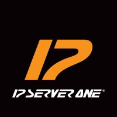
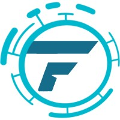

Download <a href="/resume.pdf" target="_blank">PDF resume</a>.

## Experience




<ul>
<li>Automated network deployments with <strong>Ansible</strong> and <strong>Python</strong>. </li>
<li>Built monitoring dashboards using <strong>Grafana</strong> and <strong>InfluxDB</strong>.</li>
<li>Managed <strong>Cisco</strong> and <strong>Juniper</strong> routers. </li>
<li>Developed scripts and pipelines, for an <strong>OpenStack</strong>-based cloud platform, using <strong>Bash</strong>, <strong>Ansible</strong>, <strong>Terraform</strong> and <strong>Packer</strong>.</li>
</ul>



<ul>
<li><strong>Network Technology Foundation</strong> course. Work includes aiding lecturers, teaching students, and helping them during lab sessions.</li>
</ul>



<ul>
<li>Develop frontend using <strong>React</strong>. </li>
<li>Work on backend using <strong>Supabase</strong> and <strong>Pocketbase</strong>. </li>
<li>Work on AI models, including collecting, cleaning, and labeling datasets.</li>
<li>Setting up cloud environment on <strong>AWS</strong>, and <strong>Azure</strong>. </li>
<li>Develop CI/CD pipeline on <strong>AWS</strong> using <strong>AWS-CDK</strong>.</li>
</ul>




<!-- <table>
    <thead>
        <tr>
            <th>Company</th>
            <th>Link</th>
            <th>Role</th>
            <th>Dates</th>
            <th>Location</th>
        </tr>
    </thead>
    <tbody>
        <tr>
            <td></td>
            <td><a href="https://www.ipserverone.com/" target="_blank">IP ServerOne</a></td>
            <td>Network & DevOps Engineer Intern</td>
            <td>2024/07 - 2024/12</td>
            <td>Selangor, Malaysia</td>
        </tr>
        <tr>
            <td></td>
            <td><a href="https://www.um.edu.my/" target="_blank">Universiti Malaya</a></td>
            <td>Teaching Assistant</td>
            <td>2024/03 - 2024/06</td>
            <td>Kuala Lumpur, Malaysia</td>
        </tr>
        <tr>
            <td rowspan=3></td>
            <td rowspan=3><a href="https://www.linkedin.com/company/fend-aisecurity" target="_blank">Fend</a></td>
        </tr>
        <tr>
            <td>Full Stack Developer</td>
            <td>2022/11 - 2023/05</td>
            <td rowspan=2>Remote   Kuala Lumpur, Malaysia</td>
        </tr>
        <tr>
            <td>DevOps Engineer</td>
            <td>2022/12 - 2023/05</td>
        </tr>
    </tbody>
</table> -->

---

## Certificates

<table>
    <thead>
        <tr>
            <th>Certificate</th>
            <th>Company</th>
            <th>File</th>
            <th>Date</th>
        </tr>
    </thead>
    <tbody>
        <tr>
            <td></td>
            <td><a href="https://www.cisco.com/" target="_blank">Cisco</a></td>
            <td><a href="/ccna.pdf" target="_blank">Cisco Certified Network Associate</a></td>
            <td>2024/03</td>
        </tr>
    </tbody>
</table>

---

## Education

<table>
    <thead>
        <tr>
            <th>School</th>
            <th>Link</th>
            <th>Degree</th>
            <th>Result</th>
            <th>Date</th>
        </tr>
    </thead>
    <tbody>
        <tr>
            <td></td>
            <td><a href="https://www.um.edu.my/" target="_blank">Universiti Malaya</a></td>
            <td>Bachelor's of Computer Science (Computer Systems & Network)</td>
            <td>CGPA: 3.86</td>
            <td>2021/10 - 2025/02</td>
        </tr>
    </tbody>
</table>
